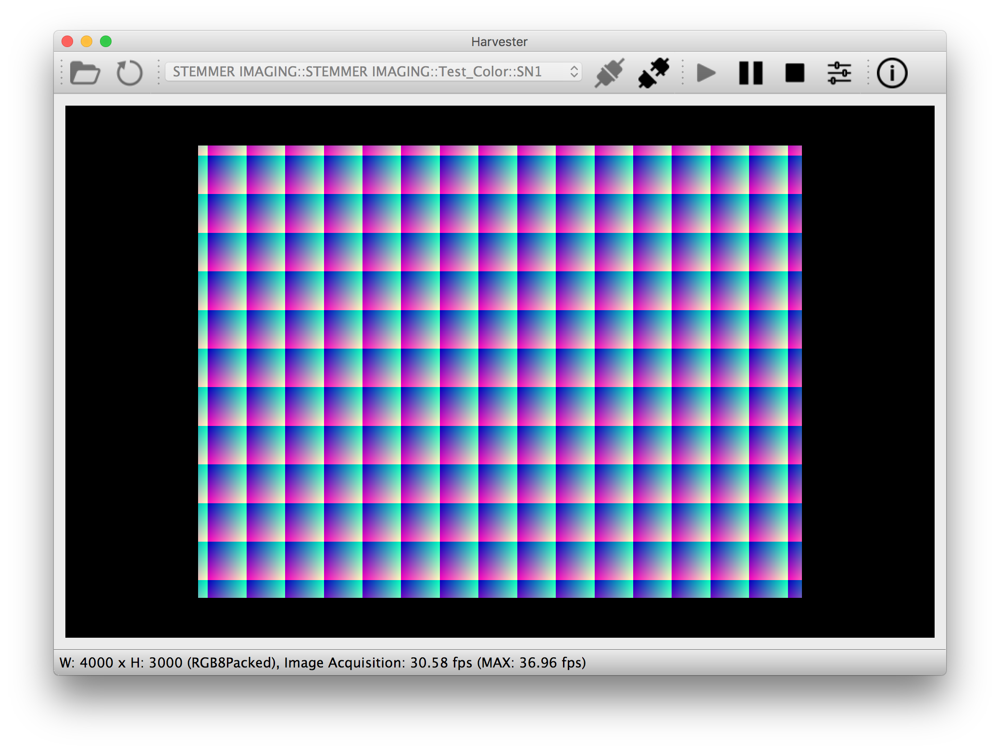
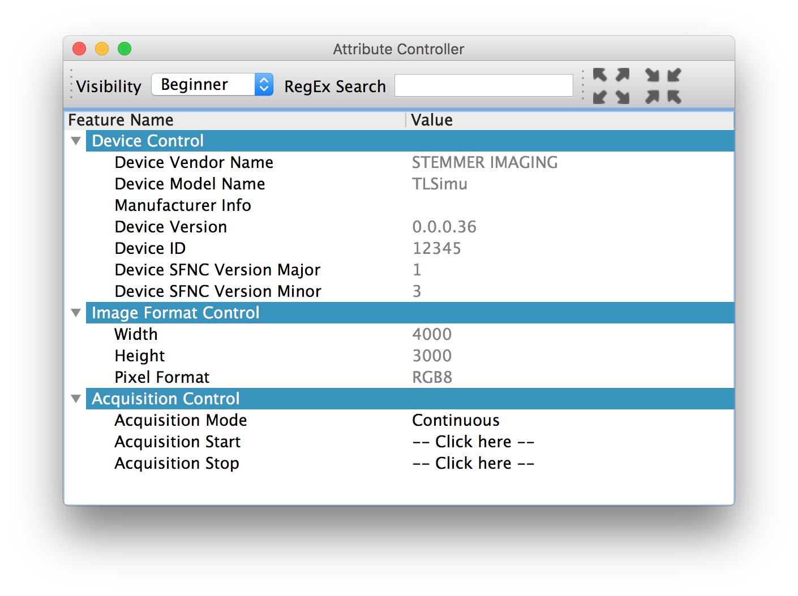

#########
Harvester
#########

Harvester is a friendly companion for people who those want to learn computer vision.

The Harvester project develops an open source Python library that consumes the GenTL Standard based image acquisition libraries, so-called GenTL Producers. If you have an officially certified GenTL Producer and GenICam compliant machine vision cameras, Harvester offers you high-performance image acquisition from the cameras and visualization of the acquired images on all major platforms. In addition, it offers you interface for numpy to make image processing easier and productive.

Currently, Harvester is GPL-3.0 licensed and it has been developed and maintained by the volunteer contributors all over the world.

.. figure:: image/readme/harvesters.jpg
    :align: center
    :alt: The Harvesters
    :scale: 55 %

    Pieter Bruegel the Elder, The Harvesters, 1565, oil on wood, © 2000–2018 The Metropolitan Museum of Art

********
Features
********

* Image acquisition over GenTL Producers
* Multiple loading of GenTL Producers in a single Python script
* Data visualization of the acquired images
* GenICam node manipulation of the target device

Note that the second item implies you can involve multiple types of transport layers in your Python script. It means you don't have to care anything about how the images are transmitted. Each transport layer has own advantages and disadvantages and you should choose appropriate transport layers following your application's requirement. You just need to acquire images for some purposes and the GenTL Producers deliver the images somehow. It truly is the great benefit of encapsulation by the GenTL Standard!

*******************
System requirements
*******************

* Python 3.4 or higher
* Officially certifiled GenTL Producers
* GenICam compliant machine vision cameras

***************************
Supported operating systems
***************************

* macOS
* Ubuntu
* Windows 7

################################
What would harvester do for you?
################################

*****************
Image acquisition
*****************

Harvester is an image acquisition engine that is written in Python. You should be able to manipulate the acquired images for image processing purpose just involving Harvester into your program. A set of Harvester, a certified GenTL Producer, and a GenICam compliant machine vision camera is the minimal setup. Having that configuration, it allows you to work on a command shell or to run your image processing script.

###########
Screenshots
###########

In this section, we see some useful GUI which Harvester offers you.

The image visualizer widget (below) offers you visualization of the acquired images. In this screenshot, Harvester is acquiring a 4000 x 3000 pixel of RGB8 Packed image at 30 fps; it means it's acquiring images at 8.6 Gbps.

The attribute controller widget (below) offers you to manipulate GenICam feature nodes of the target device. Changing exposure time, triggering the target device for image acquisition, storing a set of camera configuration so-called User Set, etc, you can manually control the target device anytime when you want to.

######################################
Why did we name the library Harvester?
######################################

Harvester's name was derived from the great Flemish painter, Pieter Bruegel the Elder's painting so-called "The Harvesters". Harvesters harvest a crop every season that has been fully grown and the harvested crop is passed to the consumers. On the other hand, image acquisition libraries acquire images as their crop and the images are passed to the following processes. We found the similarity between them and decided to name our library Harvester.

Apart from anything else, we love its peaceful and friendly name. We hope you also like it ;-)

############
Contributors
############

The initial idea about Harvester was suddenly come up to Kazunari Kudo's head in the early April 2018 and he decided to bring the first prototype to the following International Vision Standards Meeting. During the Frankfurt International Vision Standards Meeting which was held in May 2018, people confirmed Harvester really worked using machine vision cameras provided by well-known machine vision camera manufacturers in the world. Having that fact, the attendees warmly welcomed Harvester.

The following individuals have directly or indirectly contributed to the development activity of Harvester or encouraged the developers by their thoughtful warm words:

    Rod Barman, Stefan Battmer, David Beek, David Bernecker, Chris Beynon, Eric Bourbonnais, George Chamberlain, Thomas Detjen, Friedrich Dierks, Dana Diezemann, Emile Dodin, Reynold Dodson, Sascha Dorenbeck, Erik Eloff, Katie Ensign, Andreas Ertl, James Falconer, Werner Feith, Maciej Gara, Andreas Gau, Sebastien Gendreau, Francois Gobiel, Werner Goeman, Jean-Paul Goglio, Markus Grebing, Eric Gross, Ioannis Hadjicharalambous, Uwe Hagmaier, Tim Handschack, Christopher Hartmann, Reinhard Heister, Gerhard Helfrich, Jochem Herrmann, Heiko Hirschmueller, Tom Hopfner, Karsten Ingeman Christensen, Mattias Johannesson, Mark Jones, Mattias Josefsson, Martin Kersting, Stephan Kieneke, Tom Kirchner, Lutz Koschorreck, Frank Krehl, Maarten Kuijk, Max Larin, Ralf Lay, Min Liu, Sergey Loginonvskikh, Thomas Lueck, Alain Marchand, Rocco Matano, Masahide Matsubara, Stephane Maurice, Robert McCurrach, Mike Miethig, Thies Moeller, Roman Moie, Marcel Naggatz, Hartmut Nebelung, Damian Nesbitt, Quang Nhan Nguyen, Klaus-Henning Noffz, Neerav Patel, Jan Pech, Merlin Plock, Joerg Preckwinkel, Benjamin Pussacq, Dave Reaves, Thomas Reuter, Andreas Rittinger, Ryan Robe, Nicolas P. Rougier, Matthias Schaffland, Michael Schmidt, Jan Scholze, Martin Schwarzbauer, Rupert Stelz, Madhura Suresh, Chendra Hadi Suryanto, Timo Teifel, Laval Tremblay, Tim Vlaar, Silvio Voitzsch, Stefan Von Weihe, Frederik Voncken, Roman Wagner, Ansger Waschki, Anne Wendel, Jean-Michel Wintgens, Manfred Wuetschner, Jang Xu, Christoph Zierl, and Juraj Zopp

