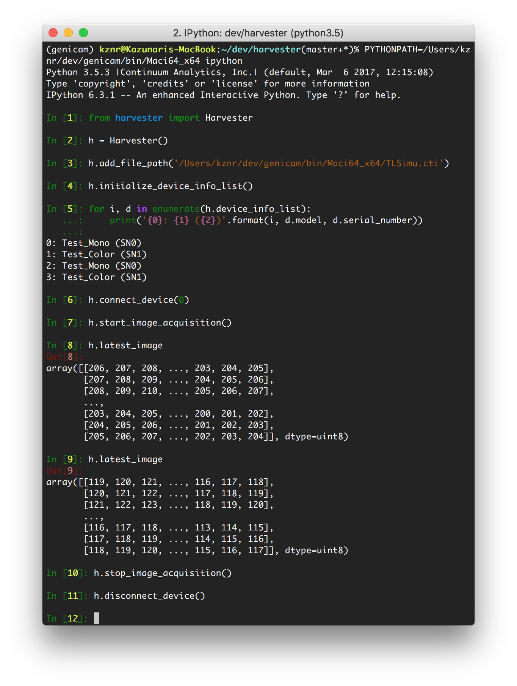
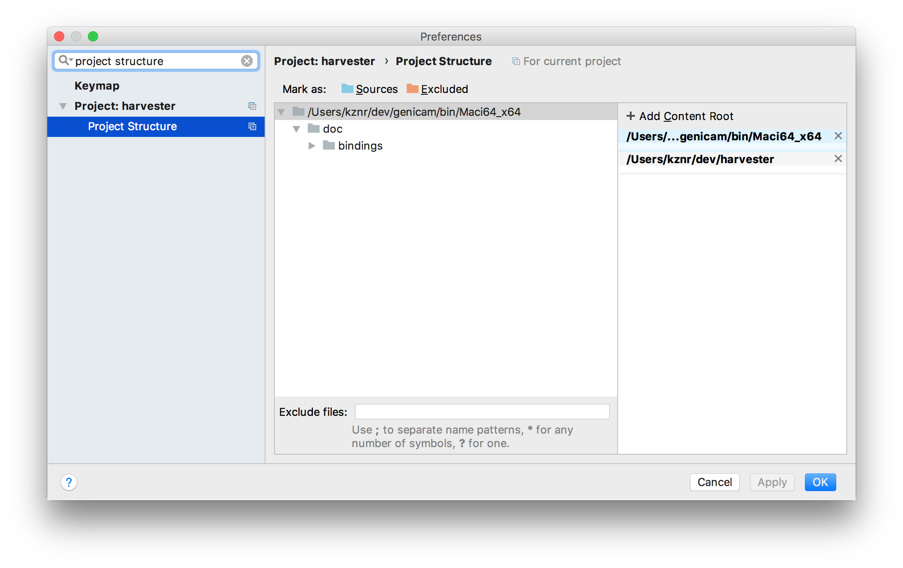
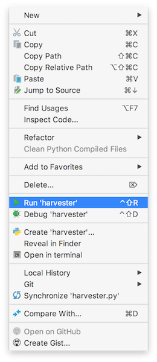
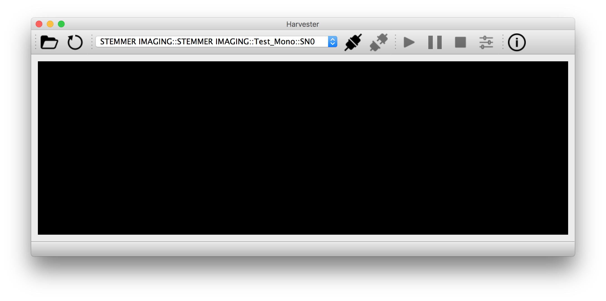

#########
Harvester
#########

Harvester is a friendly companion for people who those want to learn computer vision.

The Harvester project develops an open source Python library that consumes the GenTL Standard based image acquisition libraries, so-called GenTL Producers. If you have an officially certified GenTL Producer and GenICam compliant machine vision cameras, Harvester offers you high-performance image acquisition from the cameras and visualization of the acquired images on all major platforms. In addition, it offers you interface for numpy to make image processing easier and productive.

Currently, Harvester is Apache-2.0 licensed and it has been developed and maintained by the volunteer contributors all over the world.

.. figure:: image/readme/harvesters.jpg
    :align: center
    :alt: The Harvesters
    :scale: 55 %

    Pieter Bruegel the Elder, The Harvesters, 1565, oil on wood, © 2000–2018 The Metropolitan Museum of Art

#################
Table of contents
#################

.. contents:: Table of Contents

################################
What would Harvester do for you?
################################

Harvester mainly consists of two Python modules, one is an image acquisition engine Harvester Core and the other is GUI, Harvester GUI. In this section, we will learn what Harvester offers us.

**************
Harvester Core
**************

Harvester Core is an image acquisition engine. No GUI. You can use it as an image acquisition library which acquires images from GenTL Producers through the GenTL-Python Binding.

You'll be able to download the GenTL-Python Binding runtime library from the EMVA website, however, it's not available as of May 25th, 2018, because it's not officially released yet.

Harvester Core also works with the GenApi-Python Binding and it will allow us to control GenICam feature nodes. If you don't need runtime image data visualization, just involve this Python module in your program. In this case, Matplotlib would be ideal for you to draw the acquired images.

The main features of Harvester Core are listed as follows:

* Image acquisition over GenTL Producers
* Multiple loading of GenTL Producers in a single Python script
* GenICam node manipulation of the target device

Note that the second item implies you can involve multiple types of transport layers in your Python script. It means you don't have to care anything about how the images are transmitted. Each transport layer has own advantages and disadvantages and you should choose appropriate transport layers following your application's requirement. You just need to acquire images for some purposes and the GenTL Producers deliver the images somehow. It truly is the great benefit of encapsulation by the GenTL Standard!

On the other hand, Harvester Core could be considered as a simplified version of the GenTL-Python Binding. It just offers you a relationship between you and a device. Nothing more. If you need to manipulate more relevant GenTL modules or have to go in a hardcore way, then you should directly involve the GenTL-Python Binding.

*************
Harvester GUI
*************

Harvester GUI works on the top of Harvester Core and offers you high-performance data visualization on the fly. It involves VisPy for controlling OpenGL functionality and PyQt for providing GUI.

The main features of Harvester GUI are listed as follows:

* Data visualization of the acquired images
* Image magnification using mouse wheel or trackpad
* Image dragging using mouse or trackpad
* An arbitrary selection of image displaying point in the data path (Not implemented yet)

Unlike Harvester Core, Harvester GUI limits the number of GenTL Producers to load just one. This is just a limitation to not make the GUI complicated. In general, the user should know which GenTL Producer should be loaded to control his target device. It's not necessary to load multiple GenTL Producers for this use case. However, this is just an idea in an early stage. We might support multiple loading on even Harvester GUI in the future.

Note that VisPy is BSD licensed but PyQt is GPL/Commercial licensed.

*******************
System requirements
*******************

* Python 3.4 or higher
* Officially certifiled GenTL Producers
* GenICam compliant machine vision cameras

***************************
Supported operating systems
***************************

* macOS
* Ubuntu
* Windows

***********
Screenshots
***********

In this section, we see some useful GUI which Harvester offers you.

The image visualizer widget (below) offers you a visualization of the acquired images. In this screenshot, Harvester is acquiring a 4000 x 3000 pixel of RGB8 Packed image at 30 fps; it means it's acquiring images at 8.6 Gbps. It's quite fast isn't it?

.. image:: image/readme/image_visualizer.png
    :align: center
    :alt: Image visualizer
    :scale: 40 %

The attribute controller widget (below) offers you to manipulate GenICam feature nodes of the target device. Changing exposure time, triggering the target device for image acquisition, storing a set of camera configuration so-called User Set, etc, you can manually control the target device anytime when you want to. It supports visibility filter feature and regular expression feature. These features are useful in a case where you need to display only the features you are interested.

.. image:: image/readme/attribute_controller.png
    :align: center
    :alt: Attribute Controller
    :scale: 40 %

The following screenshot shows Harvester Core is running on IPython. Harvester Core returns the latest image data at the moment as a Numpy array every time its user call the ``latest_image`` property. Once you get an image you should be able to immediately start image processing! If you're running on Jupyter notebook, you should be able to visualize the data using Matplotlib. This step should be helpful to check what's going on your trial in the image processing flow.

############
Installation
############

The Harvester project is planning to support distribution via PyPI but it's not done yet. If once we supported it, you should be able to install Harvester invoking the following command:

.. code-block:: shell

    $ pip install genicam.harvester

In the meantime, the only way to use Harvester is cloning the Harvester package from the GitHub invoking the following command:

.. code-block:: shell

    $ git clone https://github.com/genicam/harvester.git

Harvester requires some Python modules. To install the required modules, please invoke the following command:

.. code-block:: shell

    $ pip install numpy PyQt5 vispy

If you're running Anaconda Python, then you can do the same with the following command:

.. code-block:: shell

    $ conda install numpy pyqt vispy

After that, you'll have to build the Python bindings by yourself; once they're officially released everything should be okay just downloading a distribution package.

The source code can be downloaded from the following URL using Subversion:

    https://genicam.mvtec.com/svn/genicam/branches/_dev_teli_kazunari_1881_20180121/

To build the library, please read the README file which is located at the following directory in the source package:

    source/Bindings/README.rst

####################
How to use Harvester
####################

In this section, you will learn how to use Harvester GUI and Harvester Core.

*************
Harvester GUI
*************

When you finished building the Python bindings, then you can launch Harvester. To launch Harvester Core or Harvester GUI, we would recommend you to do it on an IDE called PyCharm. You can download the community version of PyCharm for free at the following URL:

    https://www.jetbrains.com/pycharm/download

After installing PyCharm, open the Harvester package, that you have downloaded from GitHub, from PyCharm.

[IMPORTANT] By default, PyCharm doesn't know where the Python Bings are located. You can tell PyCharm the location in the Preference dialog. You should be able to find the right place just searching from the top-left corner. Then clicking ``Add Content Root`` button in the top-right corner and specify the directory.

In the Project Structure page, please add content root where the Python Bindings are located. In general, you should point at the following directory:

    genicam_root/bin/[target dependent]

Having that information, PyCharm can find out those modules which Harvester asks Python to import.

After that, you're ready to launch Harvester GUI (not only Harvester Core). To launch Harvester GUI, selecting ``harvester.py`` in the project pane, then right click it. There you should be able to find ``Run harvester`` in the popped up menu. Just click it. Harvester GUI should pop up.

Now it is the time to select a GenTL Producer to load. In the toolbar, clicking the left most button, select a CTI file to load. Then a file selection dialog should pop up. In the following example, we chose a GenTL Producer simulator so-called TLSimu.

=======
Toolbar
=======

Most of Harvester GUI's features can be used through its toolbox. In this section, we describe each button's functionality and how to use it. Regarding shortcut keys, replace ``Ctrl`` with ``Command`` on macOS.

--------------------
Selecting a CTI file
--------------------

.. image:: image/icon/open_file.png
    :align: left
    :alt: Open file
    :scale: 40 %

This button is used to select a GenTL Producer file to load. The shortcut key is ``Ctrl+o``.

--------------------------
Updating GenTL information
--------------------------

.. image:: image/icon/update.png
    :align: left
    :alt: Update
    :scale: 40 %

This button is used to update GenTL information of the GenTL Producer that you are loading on Harvester. The shortcut key is ``Ctrl+u``. It might be useful when you newly connect a device to your system.

------------------------------------
Selecting a GenICam compliant device
------------------------------------

This combo box shows a list of available GenICam compliant devices. You can select a device that you want to control.

-----------------------------------------
Connecting a selected device to Harvester
-----------------------------------------

.. image:: image/icon/connect.png
    :align: left
    :alt: Connect
    :scale: 40 %

This button is used to connect a device which is being selected by the former combo box. The shortcut key is ``Ctrl+c``. Once you connect the device, the device is exclusively controlled.

--------------------------------------------------
Disconnecting the connecting device from Harvester
--------------------------------------------------

This button is used to disconnect the connecting device from Harvester. The shortcut key is ``Ctrl+d``.

--------------------------
Starting image acquisition
--------------------------

.. image:: image/icon/start_acquisition.png
    :align: left
    :alt: Start image acquisition
    :scale: 40 %

This button is used to start image acquisition. The shortcut key is ``Ctrl+j``. The acquired images will be drawing in the following canvas pane.

---------------------
Pausing image drawing
---------------------

.. image:: image/icon/pause.png
    :align: left
    :alt: Pause
    :scale: 40 %

This button is used to temporarily stop drawing images on the canvas pane while it's keep acquiring images in the background. The shortcut key is ``Ctrl+k``. If you want to resume drawing images, just click the button again. You can do the same thing with the start image acquisition button (``Ctrl+j``).

--------------------------
Stopping image acquisition
--------------------------

.. image:: image/icon/stop_acquisition.png
    :align: left
    :alt: Stop image acquisition
    :scale: 40 %

This button is used to stop image acquisition. The shortcut key is ``Ctrl+l``.

-----------------------------------
Showing the device attribute dialog
-----------------------------------

This button is used to show the device attribute dialog. The shortcut key is ``Ctrl+a``. The device attribute dialog offers you to a way to intuitively control device attribute over a GUI.

------------------------
Showing the about dialog
------------------------

.. image:: image/icon/about.png
    :align: left
    :alt: About
    :scale: 40 %

This button is used to show the about dialog.

**************
Harvester Core
**************

TODO: Finish writing article.

################
Acknowledgements
################

Harvester GUI (but not Harvester Core) uses the following open source libraries/resources.

* VisPy (BSD)

    | Copyright (c) 2013-2018 VisPy developers
    | http://vispy.org/
        
* PyQt5 (GPL)

    | Copyright (c) 2018 Riverbank Computing Limited
    | https://www.riverbankcomputing.com/
        
* Icons8

    | Copyright (c) Icons8 LLC
    | https://icons8.com/

####################################
Why is the library called Harvester?
####################################

Harvester's name was derived from the great Flemish painter, Pieter Bruegel the Elder's painting so-called "The Harvesters". Harvesters harvest a crop every season that has been fully grown and the harvested crop is passed to the consumers. On the other hand, image acquisition libraries acquire images as their crop and the images are passed to the following processes. We found the similarity between them and decided to name our library Harvester.

Apart from anything else, we love its peaceful and friendly name. We hope you also like it ;-)

############
Contributors
############

The initial idea about Harvester suddenly came up to Kazunari Kudo's head in the early April 2018 and he decided to bring the first prototype to the following International Vision Standards Meeting. During the Frankfurt International Vision Standards Meeting which was held in May 2018, people confirmed Harvester really worked using machine vision cameras provided by well-known machine vision camera manufacturers in the world. Having that fact, the attendees warmly welcomed Harvester.

The following individuals have directly or indirectly contributed to the development activity of Harvester or encouraged the developers by their thoughtful warm words:

    Rod Barman, Stefan Battmer, David Beek, David Bernecker, Chris Beynon, Eric Bourbonnais, George Chamberlain, Thomas Detjen, Friedrich Dierks, Dana Diezemann, Emile Dodin, Reynold Dodson, Sascha Dorenbeck, Erik Eloff, Katie Ensign, Andreas Ertl, James Falconer, Werner Feith, Maciej Gara, Andreas Gau, Sebastien Gendreau, Francois Gobiel, Werner Goeman, Jean-Paul Goglio, Markus Grebing, Eric Gross, Ioannis Hadjicharalambous, Uwe Hagmaier, Tim Handschack, Christopher Hartmann, Reinhard Heister, Gerhard Helfrich, Jochem Herrmann, Heiko Hirschmueller, Tom Hopfner, Karsten Ingeman Christensen, Mattias Johannesson, Mark Jones, Mattias Josefsson, Martin Kersting, Stephan Kieneke, Tom Kirchner, Lutz Koschorreck, Frank Krehl, Maarten Kuijk, Max Larin, Ralf Lay, Min Liu, Sergey Loginonvskikh, Thomas Lueck, Alain Marchand, Rocco Matano, Masahide Matsubara, Stephane Maurice, Robert McCurrach, Mike Miethig, Thies Moeller, Roman Moie, Marcel Naggatz, Hartmut Nebelung, Damian Nesbitt, Quang Nhan Nguyen, Klaus-Henning Noffz, Neerav Patel, Jan Pech, Merlin Plock, Joerg Preckwinkel, Benjamin Pussacq, Dave Reaves, Thomas Reuter, Andreas Rittinger, Ryan Robe, Nicolas P. Rougier, Matthias Schaffland, Michael Schmidt, Jan Scholze, Martin Schwarzbauer, Rupert Stelz, Madhura Suresh, Chendra Hadi Suryanto, Timo Teifel, Laval Tremblay, Tim Vlaar, Silvio Voitzsch, Stefan Von Weihe, Frederik Voncken, Roman Wagner, Ansger Waschki, Anne Wendel, Jean-Michel Wintgens, Manfred Wuetschner, Jang Xu, Christoph Zierl, and Juraj Zopp

